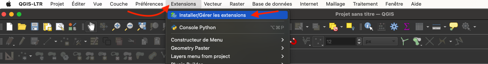
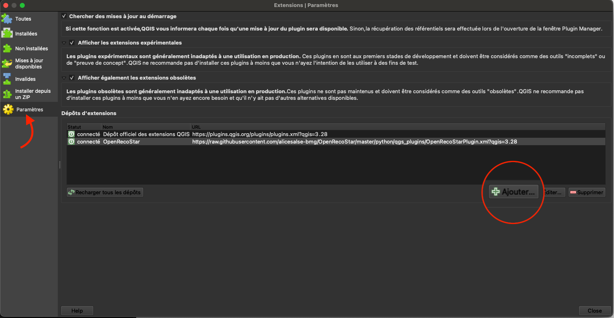
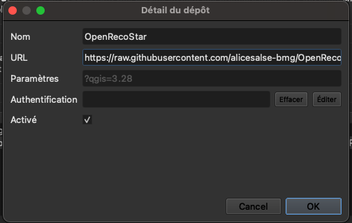
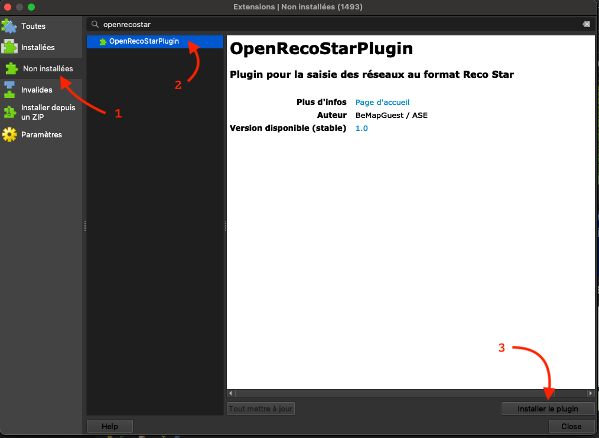
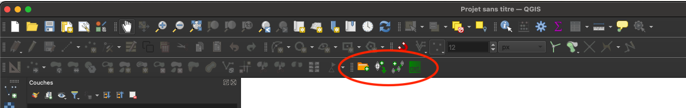
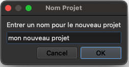
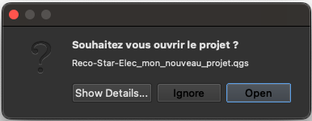

# OpenRecoStar

## 🚀 Démarrer rapidement

### Installer QGIS

* Télécharger QGIS : https://qgis.org/fr/site/forusers/download.html

* Documentation QGIS : https://www.qgis.org/fr/docs/index.htm


### Installer le plugin OpenRecoStar dans QGIS

* Ouvrir le gestionnaire d'extensions

  


* Ajouter le dépôt de l'extension OpenRecoStar à QGIS

  

  Entrer l'url du dépôt : https://github.com/alicesalse-bmg/OpenRecoStar/raw/master/python/qgs_plugins/OpenRecoStarPlugin.xml

  

* Installer l'extension

  

* Une nouvelle barre d'outils est présente dans QGIS

  


### Créer un nouveau projet

* Utiliser l'outil dédié pour la création d'un nouveau projet : 

* Choisir le répertoire (dossier) dans lequel créer le projet.

* Donner un nom à votre projet :

  

  > ⚠️  Éviter les accents et caractères spéciaux

* Le nouveau projet est automatiquement créé dans le répertoire choisi selon l'arborescence :

  ```
  📁 mon_repertoire
  └── 📁 mon_nouveau_projet
      ├── 🗺 Reco-Star-Elec_mon_nouveau_projet.qgs     <--  Fichier QGIS du projet (carte)
      └── 📁 gpkg
          ├── 🗃 Reco-Star-Elec-RPD.gpkg               <--  Géopackages contenant les données métiers
          ├── 🗃 Reco-Star-Elec-EP.gpkg
          └── 🗃 Reco-Star-xxx.gpkg
  ```

  > ⚠️  Cette arborescence doit être préservée pour ne pas corrompre l'environnement de travail.

* Le projet créé peut être ouvert directement dans QGIS à la fin du processus :

  


🎉 __Vous pouvez maintenant commencer à travailler !__
Pour en savoir plus consultez la documentation et les vidéos ci-dessous.

## 📚 Documentation

> 🚧 En cours de rédaction

📖 [Saisir des objets dans QGIS](./doc/Saisie-Qgis.md#saisir-des-objets-dans-qgis)

📖 [Présentation des outils du plugin](./doc/Outils_du_plugin.md#présentation-du-plugin-qgis)

## 📺 Vidéos

> 🚧 En cours de rédaction
