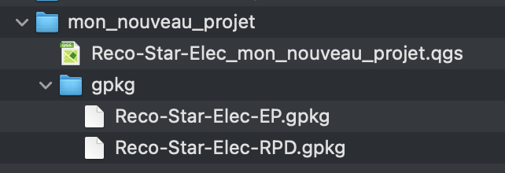
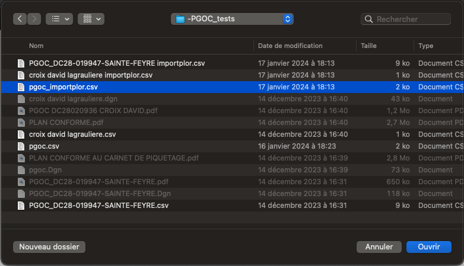
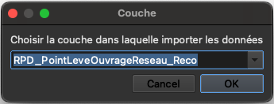
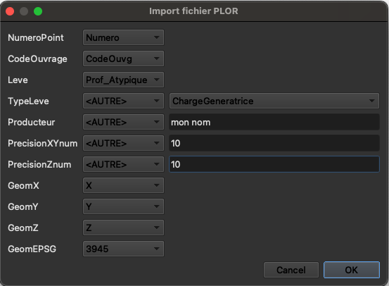
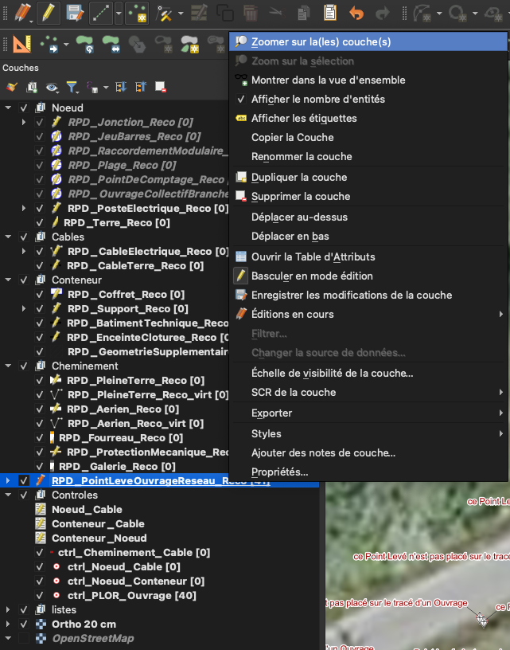
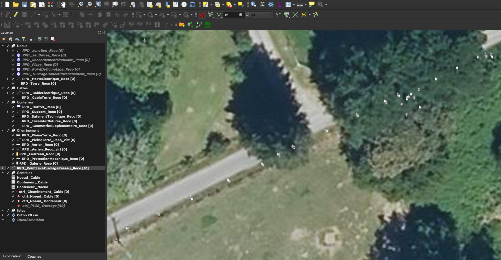

# Présentation du plugin QGIS

Ce plugin vous permet de bénéficier dans QGIS de tous les éléments nécessaires à la production d'un plan de récolement au format RecoStar.

## Prérequis

### Installation du plugin et de la barre d'outils

* Pour installer la barre d'outils, suivre les [instructions d'installation du plugin](../#installer-le-plugin-openrecostar-dans-qgis).

## Présentation de la barre d'outils

            

## 1.  Création d'un nouveau projet

Cet outil vous permet de télécharger tous les éléments nécessaires à la création d'un nouveau projet sous QGIS pour la digitalisation de votre plan de récolement au format RecoStaR. Les éléments téléchargés sont automatiquement à jour de la dernière version mise à disposition sur Git.

* Un projet QGIS (`*.qgs`) avec une carte contenant toutes les couches du RecoStar.
* Un ou plusieurs Géopackages (`*.gpkg`) permettant de stocker les données cartographiques. Il existe 1 géopackage par métier (RPD / EP / ...).

> ⚠️ Tous ces fichiers doivent rester ensemble dans le même répetoire pour ne pas corrompre votre projet.

Pour en savoir plus sur la création d'un projet et démarrer rapidement [suivez les instructions](../#créer-un-nouveau-projet).

Pour ouvrir votre projet dans QGIS, double-cliquez sur le fichier `Reco-Star-Elec_xxx.qgs`.

## 2.  Importer un fichier de points levés

Avec cet outil vous pouvez importer facilement les points levés issus de votre collecte terrain dans la couche dédiée du RecoStar.

Les formats supportés actuellement sont le `*.csv` et le `*.shp`.

* __Prérequis__ : Avant  de commencer il est nécessaire d'[Ouvrir une session de mise a jour](./Saisie-Qgis.md#ouvrir-une-session-de-mise-à-jour). 

* Cliquer sur l'outil : 

* Choisir le fichier à importer :

  

* Definir la couche dans laquelle importer les points (RPD / EP / ...) :

  

* Si vous avez omis de le faire vous disposez à cette étape de 5 secondes pour : [Ouvrir une session de mise a jour](./Saisie-Qgis.md#ouvrir-une-session-de-mise-à-jour).

  

* Faire correspondre les attributs (colonnes) du fichier CSV ou SHP en entrée avec les attributs de la couche `*_PointLeveOuvrageReseau_Reco`.

  Si aucun attribut ne correspond, choisir `<AUTRE>` et saisir la valeur par défaut à appliquer à tous les points.

  Pour les CSV, les attributs `GeomX, GeomY, GeomZ` doivent impérativement contenir les coordonnées des points levés X, Y, Z.

  Ne pas oublier de renseigner le système de projection dans lequel les points ont été levés dans `GeomEPSG`.

  L'attribut `Levé` contiendra par défaut (si aucune valeur n'est renseignée) la valeur Z correspondant à l'_altitude de la génératrice_.

  Le `CodeOuvrage` n'est pas documenté dans le RecoStaR mais permet d'utiliser facilement l'[outil de tracé automatique](#3--tracer-des-lignes-à-partir-des-points-levés). Il contient un code distinct pour chaque ouvrage levé et permet d'identifier facilement tous les points levés qui correspondent à un câble, par exemple, pour générer le tracé de celui-ci automatiquement.
    > ⚠️ à ne pas confondre avec le `Code_PGOC`

  

  > 📓 Pour la définition détaillée de chaque attribut, se reporter à la documentation RecoStaR.

* Clic droit sur la couche `*_PointLeveOuvrageReseau_Reco` dans le gestionnaire de couches > Zoomer sur la couche. Vous permet de localiser la carte au nievau des points levés importés.

  

* Si le rendu vous convient, [Sauvegarder la mise à jour](./Saisie-Qgis.md#sauvegarder-les-modifications). 

